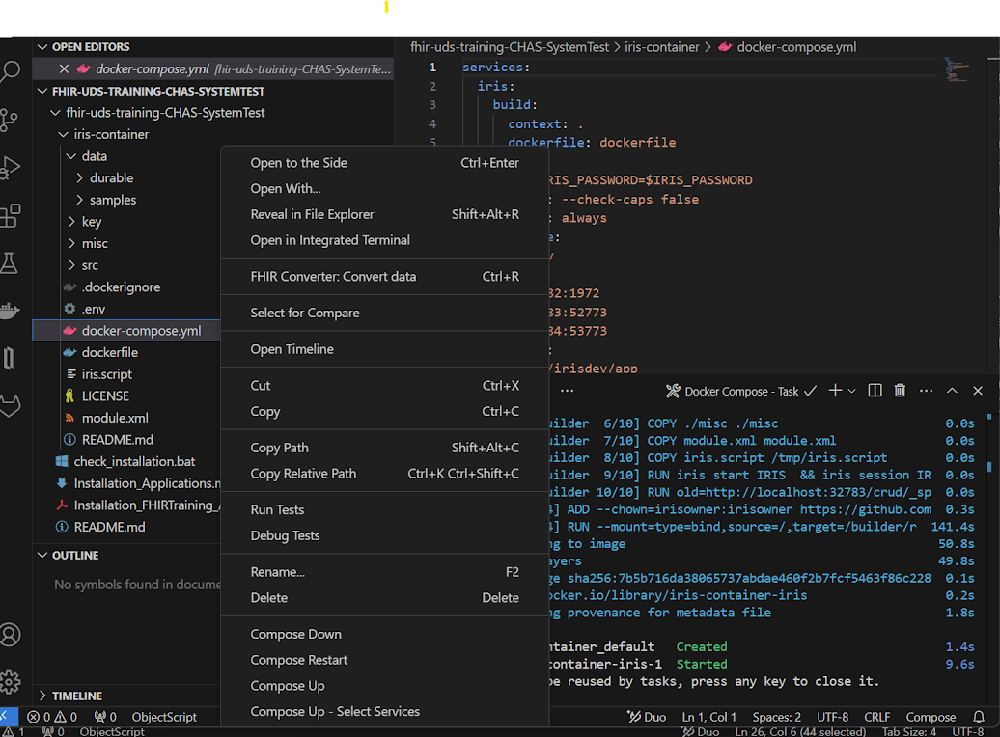

# Installation Guide for FHIR Training

This guide provides step-by-step instructions to install essential applications for development, including Docker Desktop, Postman, and VSCode (with FHIR extensions).

If you already have any of the applications installed, you do not need to re-install. 

All of the tools listed here are available for free and open use. You may be asked to provide an e-mail and sign-up for in order to download the tools. 

---

## 1. Install Docker Desktop

Docker Desktop allows you to build, share, and run containerized applications on your local machine.

### Steps:
1. Go to the official Docker Desktop download page:  
   [Download Docker Desktop](https://www.docker.com/products/docker-desktop)
2. Select the appropriate version for your operating system (Windows, macOS, or Linux).
3. Download and run the installer.
4. Follow the installation wizard instructions.
5. After installation, launch Docker Desktop and ensure it’s running.

For detailed installation instructions, refer to Docker's [documentation](https://docs.docker.com/desktop/install/).

---

## 2. Install Postman Desktop Application

Postman is a popular tool for API development and testing.

### Steps:
1. Go to the official Postman download page:  
   [Download Postman Desktop Application](https://www.postman.com/downloads/)
2. Choose the correct version for your operating system (Windows, macOS, or Linux).
3. Download and run the installer.
4. After installation, launch Postman and sign in or create an account.

For more information, visit the official [Postman documentation](https://learning.postman.com/docs/getting-started/installation-and-updates/).

---

## 3. Install Visual Studio Code (VSCode)

Visual Studio Code is a lightweight, open-source code editor developed by Microsoft.

### Steps:
1. Go to the official Visual Studio Code download page:  
   [Download VSCode](https://code.visualstudio.com/)
2. Download the installer for your operating system (Windows, macOS, or Linux).
3. Run the installer and follow the setup instructions.
4. After installation, launch VSCode.

---

### Install Docker, FHIR Tools. and FHIR JSON Tooling Extensions in VSCode

These extensions are necessary for working with FHIR resources and Docker in VSCode.

### Steps:
1. Open Visual Studio Code.
2. Go to the **Extensions** tab (or press `Ctrl+Shift+X`).
3. In the search bar, type `Docker` and install the extension. 
4. In the search bar, type `FHIR` and install the following:
   - **FHIR Tools**  
     [FHIR Tools Extension](https://marketplace.visualstudio.com/items?itemName=Yannick-Lagger.vscode-fhir-tools)
   - **FHIR JSON Tooling**  
     [FHIR JSON Tooling Extension](https://marketplace.visualstudio.com/items?itemName=cqframework.fhir-json)
   - **Docker Tools**  
     [Docker Tools Extension](https://marketplace.visualstudio.com/items?itemName=ms-azuretools.vscode-docker)
     

---

## 4. Download Training Repository from GitHub

GitHub is a platform for version control and collaboration on code projects.

### Steps:
1. Go to the GitHub page we have set up for you
      https://github.com/LEADNorthLLC/fhir-uds-training/releases/tag/CHAS-SystemTest
2. Download the Source code (zip)
3. Extract the download

---

## 5. Install Notepad++

For a lightweight, all-purpose text editor, Notepad++ is a useful application with many useful features for viewing files. 

Follow the link below and download the latest installer for your platform, Windows x64 or 32-bit, or ARM64 for MacOS. 

[Download and Install Notepad++](https://notepad-plus-plus.org/downloads/)

## 6. Run the Training IRIS Instance in Docker

Using the VSCode Docker extension we can run our docker container through VSCode.

Open the iris-container folder. Find and right click the docker-compose.yml file. We have inculded a screenshot to help you find it.

Then at the bottom of the pop up you should click Compose Up.

You can then access healthshare with the following link
   
   http://localhost:32783/csp/sys/UtilHome.csp

## Summary

- **Docker Desktop** allows containerized app development.
- **Postman Desktop** facilitates API testing.
- **VSCode** is a powerful code editor, and the **FHIR Tools** and **FHIR JSON Tooling** extensions provide necessary FHIR functionalities.
- **GitHub** is essential for version control, and signing up with your work account is recommended for collaboration.
- **Notepad++** is a lightweight text editor with many useful features for viewing files.
