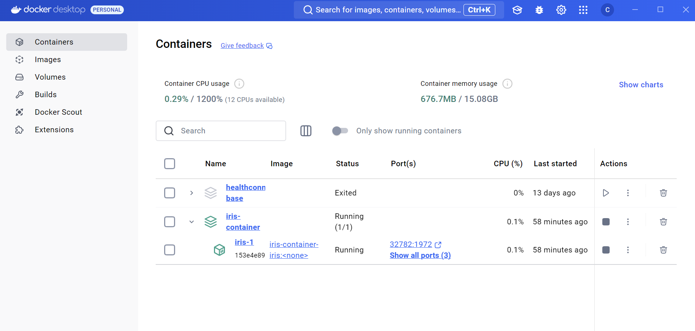

# FHIR UDS TRAINING

This repository sets up a training Docker instance that runs the latest version of IRIS for Health off the Community docker image. 

## Getting Started

1. Obtain a setup .zip file that contains the repository. 

2. Unzip the folder on your local system. 

3. Open the folder in VSCode and locate the **iris-container/docker-compose.yml**. 

4. Start the docker instance by running the following command from the Terminal. 

```bash


```
> Alternatively, if you have the Docker VSCode extension installed, you can right-click and select **Compose Restart**. 

> IMPORTANT: Changes made in the IRIS container instance will be lost whenever the **Compose** commands are run as the instance will be rebuilt. Make sure any code changes you've made have been saved into permanent locations in the **iris-container/src** folder or in another persistent location before executing **Compose - Restart**, **Compose - Down**, **Compose-Up**. While working on the training exercises, use the **Start-Stop** buttons from Docker Desktop whenever you need to stop or start the container. 



## Accessing the IRIS Management Portal

Once the container is running, access the Management Portal through this URL in your browser:

```bash
http://localhost:32783/csp/sys/UtilHome.csp

```

Or to go directly to the **FHIRDEMO** Namespace Production:

```bash
http://localhost:32783/csp/healthshare/fhirdemo/EnsPortal.ProductionConfig.zen

```

* Log in with the `_system/SYS` user/password.

## Opening a Terminal in VSCode

1. Open the InterSystems Terminal from VS Code. First make sure the Docker container is running. Open a Terminal by going to **View Menu -> Terminal**

2. This opens the Terminal window at the bottom of the project. (It may already be open). 
* Find the `+` sign with the pull down. 
* Select `Git Bash` as the terminal type. 
* Type `docker ps` to figure out the name of the container. In this case `iris-container-1`
* Once you have the name, type this command to start the shell. You will be looking at the internal Docker file system: 

```bash
  docker exec -it **iris container name** bash
```
* From the new command prompt, open IRIS terminal by typing: `iris session IRIS`
* Log in with the `_system/SYS` user/password

Here is a screenshot showing the commands: 

