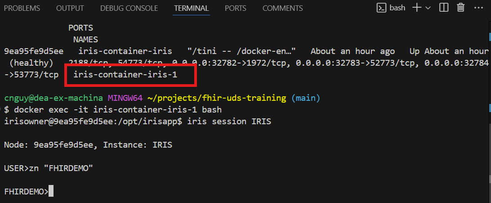

# Module 5: Exercise 1


# Setting up your environment

**Objective:** This exercise aims to set up your environment for future exercises. 

**Note:** You may need to refer back to these instructions as you start other exercises or if you stop partway through an exercise.  

To start, please make sure you have the following extensions installed in Visual Studio Code:
	* InterSystems ObjectScript
 	* InterSystems Server Manager
  	* InterSystems Language Server
   	* InterSystems ObjectScript Extension Pack

Download the latest version of this repository (or unzip onto your local machine if provided a zip file).  Open the unzipped folder from Visual Studio Code.  

Next you'll need to build and start your docker container. Make sure your Docker desktop application is running. Once that is confirmed, ensure you don't have any older versions of this code running in Docker.  If so, stop those containers and delete them if not needed.  

Open a terminal prompt from the root folder of the codebase and navigate to the **\iris-container** folder and run the following command.

	docker-compose up --build -d

This command will take a few moments to run.

Once your container is running you can now access the IRIS portal at the following url:

	http://localhost:32783/csp/sys/%25CSP.Portal.Home.zen?$NAMESPACE=%25SYS

## Starting the Production
Now we just need to start the production before we can move forward. Click on **Interoperability** and navigate to the **FHIRDEMO** namespace if not already selected. Click **Configure** then **Production** and finally **Go**.

Inside the Production Configuration screen, you just need to click **START** (you'll be adding production components later).

## Opening a Terminal in VSCode

1. Open the InterSystems Terminal from VS Code. First make sure the Docker container is running. Open a Terminal by going to **View Menu -> Terminal**

2. This opens the Terminal window at the bottom of the project. (It may already be open). 
* Find the `+` sign with the pull down. 
* Select `Git Bash` as the terminal type. 
* Type `docker ps` to figure out the name of the container. In this case `iris-container-1`
* Once you have the name, type this command to start the shell. You will be looking at the internal Docker file system: 

```bash
	docker exec -it **iris container name** bash
```
* From the new command prompt, open IRIS terminal by typing: `iris session IRIS`
* Log in with the `_system/SYS` user/password

Here is a screenshot showing the commands: 


Save the above command somewhere handy for later reference.

## Configure InterSystems Server Extension

Click on the "Extensions" icon (looks like building blocks) on the left side bar of Visual Studio Code.  
Select InterSystems Server Manager.
Click on the gear icon and choose "Settings".
Click on the link to "Edit in settings.json".
At the top of the file, under the opening curly brace, insert:

```
"intersystems.servers": {
    
        "local": {
            "webServer": {
                "scheme": "http",
                "host": "localhost",
                "port": 32783
            },
            "username": "_System"
        }
    },
```
Access the File menu and choose Save.
Now, choose the "I" or Intersystems icon from the left side bar.
Under the Explorer area of the screen, click on the button labelled "Choose Server and Namespace."
Choose "fhir-uds-training-main".
Choose "local" if prompted, choose the "FHIRDEMO" namespace and login with _System/SYS if prompted.
You will now be able to navigate "server-side" code that is present for this instance.
