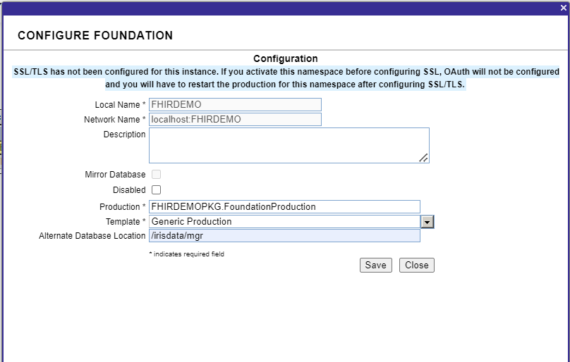

# Module 6 - Exercise 1

**Learning Objectives:** 
	* Build an end-to-end FHIR pipeline
	* Learn about the standard IRIS FHIR code base
	* Be able to identify the location of standard DTLs
	* Build custom SDA Extensions
	* Build custom FHIR mappings

# Activate the FHIRDEMO namespace

A FHIRDEMO namespace exists in the IRIS instance, but has not been activated. In order to complete and save your work, the FHIRDEMO namespace will be created in a location that is mounted to a folder in the training repository. 

1. Start the docker instance by right clicking on the `docker-compose.yml` file located in the `iris-container` folder. Click on the file name and select `Compose Restart` to stop and start the Docker container. 

This can also be done from the terminal with the following command:
```bash
	docker-compose up --build -d
```
This command will take a few moments to run.

2. Once your container is running you can now access the Healthshare portal at the following url:

	*[http://localhost:32783/csp/sys/UtilHome.csp](http://localhost:32783/csp/sys/UtilHome.csp)*

3. Select **Health** and then select the **Installer Wizard** at bar on the top right. You should see two namespaces: **FHIRDEMO** and **HEALTHTOOLKIT**. Only HEALTHTOOLKIT is active.   

4. **Configure Network Host Name:** Replace the autogenerated value by hardcoding it with `localhost`

3. **Set Database Location:** Click on **Edit** for FHIRDEMO. Go to **Alternate Database Location** and set it to **/irisdata/mgr**. Use defaults for other values and click **Save**. 



4. **Activate Namespace:** Click on the <ins>Activate</ins> for the **FHIRDEMO** namespace. Click **Start** and wait for the activation process to complete. If it seems to hang you can close and then come back in and select **Start** again. (You will see an **Activation Done** message when the process is done.)

5. Close the form and confirm that the **Activated** column for FHIRDEMO is now set to 1. 

6. Go to `iris-container/data/durable` in VSCode. You will see an **mgr** folder. If you open that, you will see **FHIRDEMO** and the **IRIS.DAT** file. These are the files that store code and configuration changes to the **FHIRDEMO** namespace. 

7. **Open the Production:** Navigate to the production by selecting **HOME->Interoperability**. You will see **FHIRDEMO** now. Select **FHIRDEMO** and then in the next screen, click the **Go** button to view the production. 

8. **Add a Business Service:** Click on the plus `+` next to the **Services** header. 

Configure these settings: 

| **Configuration Name**  | **Value** |
|:-----------------------:|:---------:|
| Service Class | EnsLib.HL7.Service.FileService |
|Service Name|HL7InboundFileService|
|Display Category|Module6-Exercise1|
|Enable Now|Selected|


The service should be added to the production now. 

9. **Add a Custom Business Process:**

9. **Add the FHIR to DTL process:**


If you stop Docker and restart it, you should still see this change as long as you do not delete the files in the `data` folder locally.

> Tip: You can keep the Docker service > running in the background while you work. If you want to shut it down, select **Compose - Down**. When you want to restart it, select **Compose - Up**. It will start up much faster than when you select **Compose - Rebuild** 

