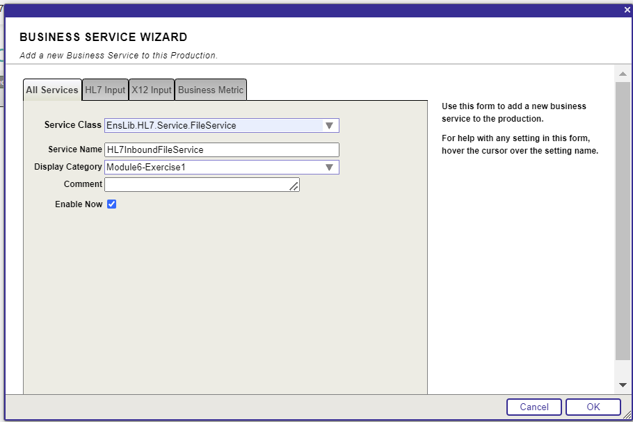
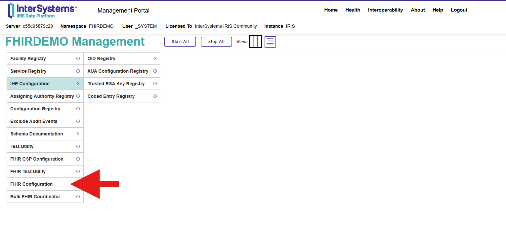
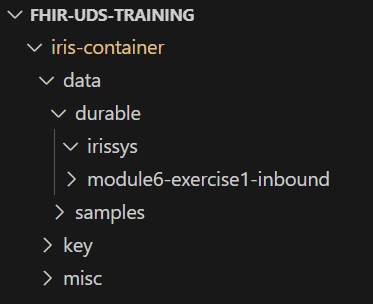
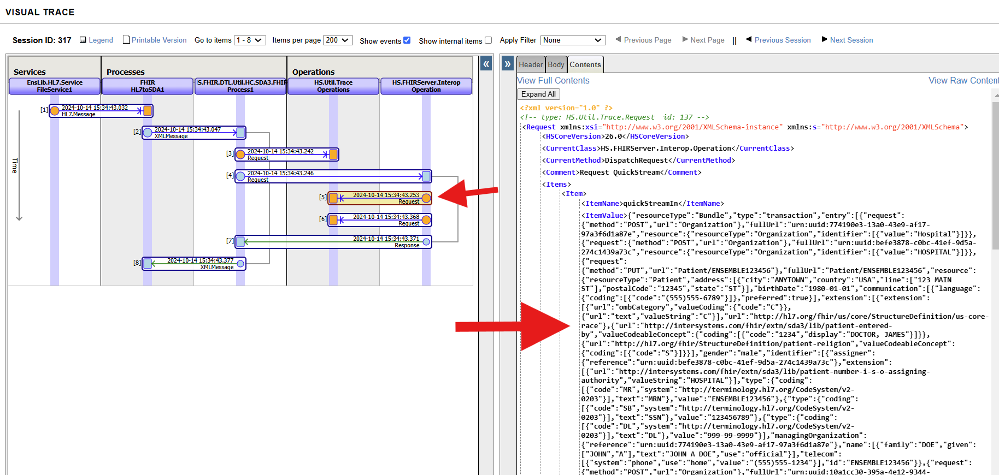
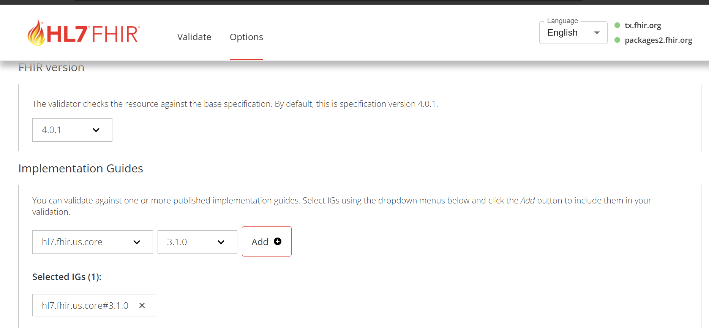

# Module 6: Exercise 1

# Creating an HL7 to FHIR Integration

**Learning Objectives:** 
* Build an end-to-end HL7 to FHIR pipeline
* Learn about standard IRIS FHIR processes, operations, and transformations
* Configure the IRIS FHIR Server
* Read a FHIR message trace
* Validate a FHIR Bundle using FHIR Vaildator

Ensure your container is running or refer back to Module 5: Exercise 1.

**Load Necessary Code:** From the IRIS System Management Portal, navigate to System Explorer -> Classes.  Select Import and choose **My Local Machine** and click on Browse to locate all files found under the /irisdata/module6-exercise1-code/ folder. Make sure File of type is set to All Files (*) so you can see all the files available to select.  Once all files are selected, choose Next and then Import. The code should all compile without errors.

From the IRIS System Management Portal, open the FHIRDEMO Production by navigating to Interoperability -> Configure -> Production from the **FHIRDEMO** namespace.  Execute the following steps:

1. **Add a Business Service:** Click on the plus `+` next to the **Services** header. 

Configure these **Business Service** settings in the wizard: 

| **Configuration Name**  | **Value** |
|:-----------------------:|:---------:|
| Service Class | EnsLib.HL7.Service.FileService |
| Service Name | HL7InboundFileService1 |
| Display Category | Module6-Exercise1 |
| Enable Now | Selected |

The service should be added to the production now. 

2. **Add a Business Process:** Click on the `+` symbol next to the **Processes** header. 

Configure these **Business Process** settings in the wizard: 

| **Configuration Name**  | **Value** |
|:-----------------------:|:---------:|
| Business Process Class | HS.Local.FHIR.HL7toSDAProcess |
| Business Process Name | FHIR.HL7toSDA1 |
| Display Category | Module6-Exercise1 |
| Enable Now | Selected |

3. **Add the Standard FHIR Business Process:** Click on the `+` symbol next to the **Processes** header. (We will have two business prcesses).

Configure these **Business Process** settings in the wizard: 

| **Configuration Name**  | **Value** |
|:-----------------------:|:---------:|
| Business Process Class | HS.FHIR.DTL.Util.HC.SDA3.FHIR.Process |
| Business Process Name | HS.FHIR.DTL.Util.HC.SDA3.FHIR.Process1 |
| Display Category | Module6-Exercise1 |
| Enable Now | Selected |

4. **Add a Standard FHIR Server Operation:** Click on the `+` symbol next to the **Operations** header. 

Configure these **Business Operation** settings in the wizard: 

| **Configuration Name**  | **Value** |
|:-----------------------:|:---------:|
| Operation Class | HS.FHIRServer.Interop.Operation |
| Operation Name | HS.FHIRServer.Interop.Operation |
| Display Category | Module6-Exercise1 |
| Enable Now | Selected |

5. **Build End-to-End**: Now you have four business components. In order to hook them together to run and end-to-end, we'll cover the **Properties** for each of the components. 

*5-1*. Start on the left by clicking on the icon/name for the **HL7InboundFileService1** service: 

Then click on the **Settings** tab on the right panel to configure the service properties: 

| **Property Name**  | **Value** |
|:-----------------------:|:---------:|
| File Path | /irisdata/module6-exercise1-inbound/ |
| TargetConfigNames | FHIR.HL7toSDA1 |

Make sure to click **Apply** to save your Settings. 

*5-2*. Click on the icon/name for the **FHIR.HL7toSDA1** Process. 

This is a custom process that is identifying what HL7 field will be set as the `PatientResourceId`, which is required in the Patient Resource. Configure the following Settings.   

| **Property Name**  | **Value** |
|:-----------------------:|:---------:|
| PatientIdLocation | PID:3.1 |
| TargetConfigNames | HS.FHIR.DTL.Util.HC.SDA3.FHIR.Process1 |

Make sure to click **Apply** to save your Settings. 

*5-3*. Click on the icon/name for the **HS.FHIR.DTL.Util.HC.SDA3.FHIR.Process1** Process. 

Configure the following Settings.   

| **Property Name**  | **Value** |
|:-----------------------:|:---------:|
| TargetConfigNames | HS.FHIRServer.Interop.Operation |
| TransmissionMode | transaction |
| FHIRMetadataSet | HL7v40 / FHIR R4 Core Specification |
| FHIREndpoint* | /csp/healthshare/fhirdemo/fhir/r4/ |   <-- don't forget the final slash in this path!
| LogTraceEvents | *checked* |
| TraceOperations | `*FULL*` |

* The **FHIREndpoint** path doesn't yet exist, but you will configure this in a few steps. 

Make sure to click **Apply** to save your Settings. 

6. **Add the Trace Logging Operation** 

| **Configuration Name**  | **Value** |
|:-----------------------:|:---------:|
| Operation Class | HS.Util.Trace.Operations |
| Operation Name | HS.Util.Trace.Operations |
| Display Category | Module6-Exercise1 |
| Enable Now | Selected |

Make sure to click **Apply** to save your Settings. 

7. **Configure the FHIR Server**

With the **FHIRDEMO** namespace selected, click on **Home** and then select **HEALTH** either on the panel on the left or at the top of the System Management portal. 

Select the **FHIR Configuration** section: 

*7-1*. Log in with the same username and password for IRIS. User:`_system` Password: `SYS`

*7-2*. Select **Server Configuration** and then click the **Add Endpoint** button. 

Enter these configurations: 
Configure the following Settings.   

| **Property Name**  | **Value** |
|:-----------------------:|:---------:|
| CORE FHIR package | hl7.fhir.r4.core@4.0.1 |
| URL | /csp/healthshare/fhirdemo/fhir/r4 |
| Additional packages | hl7.fhir.us.core@3.1.0 |
| Interactions Strategy Class | HS.FHIRServer.Storage.Json.Interactions.Strategy |
| Storage | *Keep all default values* |

Click **Add**. It will take a few minutes to build the endpoint. You can leave this screen and return to VSCode while the endpoint builds. 

8. **Create the data input directory in VS Code**

Typically, the file system in the Docker container is completely separate from the folders and files you have in the project folder. However, the container has been set up with a bind mount that connects the `iris-container/data/durable` folder in the FHIR-UDS-TRAINING project with the `/irisdata` folder in the IRIS instance. 

*8-1*. In VSCode, right click on the `iris-continer/data/durable` folder and select `Add Folder`. Name the folder `module6-exercise1-inbound` in order to match what you configured in the Business Service Settings in the IRIS production. 

Your folders will look like this (Don't worry if the top-level name is more detailed than `FHIR-UDS-TRAINING`): 

*8-2*. Open the `samples` folder. Right click on the `ADT_A01JohnDoe.hl7` file and select `Copy`. 

*8-3*. Click on the `module6-exercise1-inbound` folder. Right click and select `Paste`. 

You will see the file copied into the directory and then it may disappear. This is good news. The inbound file service running in IRIS has picked it up and attempted to process it. 

9. **Check the Production:** Return to your System Management Portal. If you are looking at the "FHIR Server" screen, you can click on the profile for the `_System` user in the right corner. Once you click on the icon, select **Management Portal** to retrn **Home**.  

Go to **Home -> Interoperability -> Select FHIRDEMO -> Configure -> Production**. 

Click on the **Messages** tab. You should see the available message traces. Click on the link under **Header** to trace the activity. 

If you see errors, read the error messages, doouble check settings, and try to fix things so you get a complete message trace (see below). If you ever need to re-run the message, you can re-send from the **Message Viewer** or drop the file again like you did in **Step 8-2**.

10. **Review the Message Trace:**

If everything has gone well, Step 3 of the trace will show the actual FHIR bundle that was sent to the local FHIR Server. 

11. Review the steps in the message trace. Can you confirm whether or not the FHIR bundle posted successfully? What was the response status code from the FHIR Server? 

12. You turned on `*FULL*` Trace so you could see detailed information like the actual FHIR bundle. 

> This is a good technique for testing, but should be turned off once the interface is in production as FHIR bundles can get very big.

Click on Step 3 and on `View Raw =Contents`. Copy the JSON string in the **<ItemValue>** tags, but do not include the XML tag. 

13. Go to the FHIR validator at [FHIR Validator](https://validator.fhir.org). 

*13-1*. Select the **Options** menu at the top. Then select the **FHIR Version (4.0.1)** and **Implementation Guides (hl7.fhir.us.core version 3.1.0)** and select **Add**.

This is the version of the FHIR Server we are checking against (remember when we configured those packages on the endpoint?)

*13-2*. Click back on **Validate** and paste the JSON into the **Enter Resource** window. 

Select the **Validate** button at the bottom of the screen and review the errors and warnings. 

14. Even though the FHIR bundle was accepted by the IRIS FHIR Server, there are many errors still when the message is validated against the official specifications. FHIR Servers will vary in how strict their validations are and whether they are configured to reject messages or accept them when there are non-conformance issues that are not deemed fatal. 

15. Now that you have completed an end-to-end, go back to the **FHIRDEMO** and try to figure out how to do each of these: 

*15-1*. What happens when you send another HL7 message through? What about an ORU? 

*15-2*. How can you configure the components to send indivudal resources rather than an entire bundle at once? 

*15-3*. How can you configure the feed to use the **Message Control ID (MSH:10)** as the `PatientResourceId`? (You wouldn't necessarily want to do this, but it is good to see how the message changes when that's done)

*15-4*. **Bonus!!!** Can you figure out how to use Postman to query back the message you just sent in? 

> DO NOT do a ***COMPOSE RESTART*** on the container. This will rebuild the container and you will lose all changes unless you have saved them first. 

## To Save the Production: 

You can copy the contents of the **FHIRDEMO.FoundationProduction** class to the **FHIR-UDS-TRAINING/src/FHIRDEMOPKG** folder via Cache Studio or Visual Studio Code.  

> Tip: You can keep the Docker service > running in the background while you work. If you want to shut it down, select **Compose - Down**. When you want to restart it, select **Compose - Up**. It will start up much faster than when you select **Compose - Restart** however all your coding and configuration changes will be reset. 

> Solution: There is a completed production class saved in the [Module 6 Solutions Folder](../solutions/exercise-1/FHIRDEMO.FoundationProduction.cls). This contains the production configuration, but does not contain the FHIR Server configuration. 
