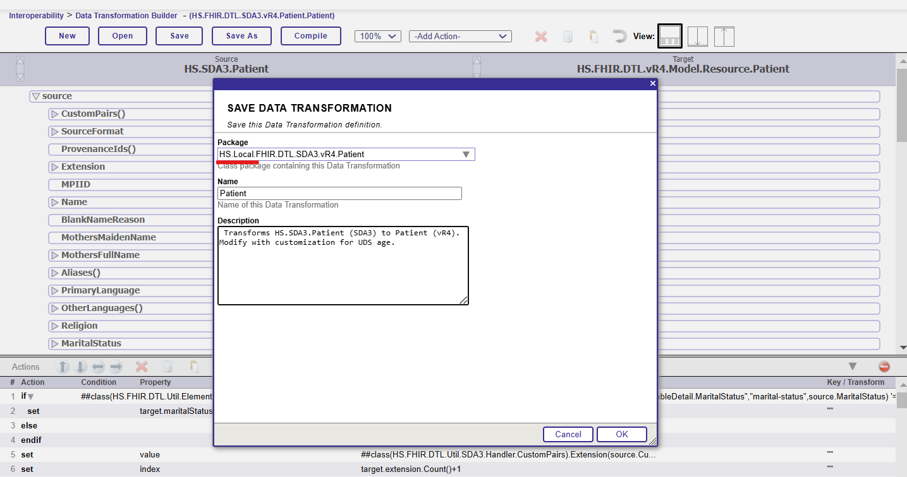
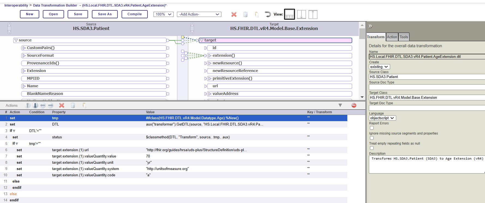
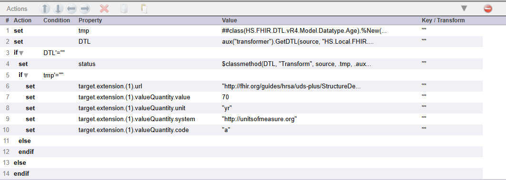
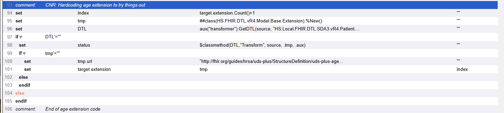
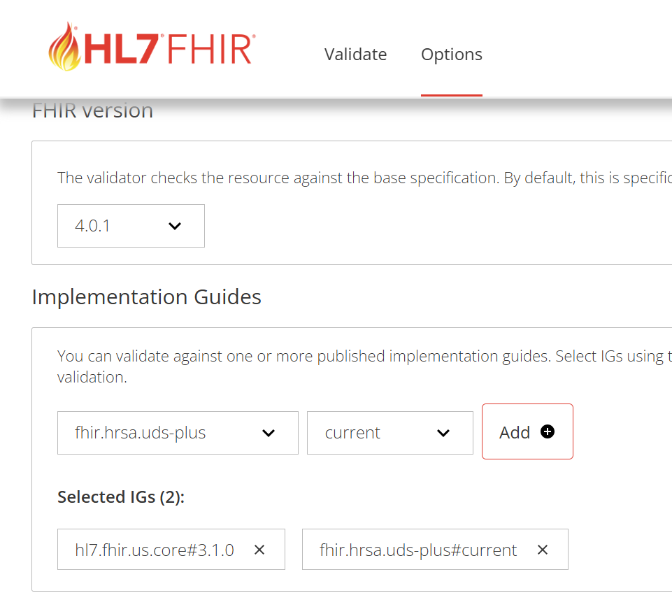
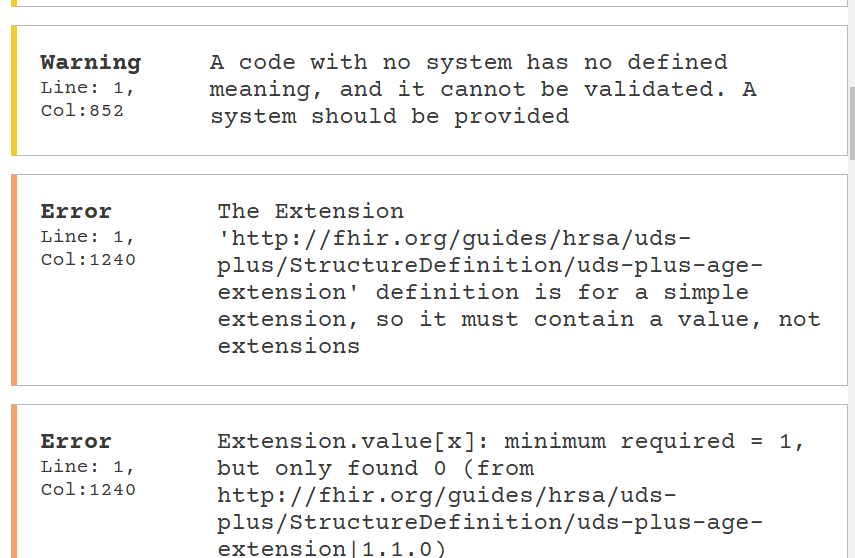

# Module 6: Exercise 2

# Creating a Custom DTL

**Learning Objective:** 
* Identify the location of standard DTLs
* Create custom DTLs for mapping FHIR resources
* Create sub-transform DTL for mapping UDS age extension
* Validate FHIR bundle against UDS definitions

**Reference:** [SDA to FHIR Transformation Product Documentation](https://docs.intersystems.com/irisforhealthlatest/csp/docbook/DocBook.UI.Page.cls?KEY=HXFHIR_transforms)

**Task:** The UDS Profile for the Patient Resource contains extensions that are unique to UDS. In this exercise, you will be customizing the Patient Resource transformation in order to include the UDS Plus Age Extension. The output format should look like the following sample:

```bash
{
      "url" : "http://fhir.org/guides/hrsa/uds-plus/StructureDefinition/uds-plus-age-extension",
      "valueQuantity" : {
        "value" : 70,
        "unit" : "yr",
        "system" : "http://unitsofmeasure.org",
        "code" : "a"
}
    
```

**Requirements:**
Calculate the age *value* by taking the current year and subtracting the year sent in the **source.birthTime** field in the SDA. You will hardcode the other values in the extension.  

## Setting up a Custom Transformation Package
First set the location of the custom DTL library

1. First make sure the Docker container is running.
2. From Visual Studio Code, open Terminal by going to **View Menu -> Terminal**
3. Open an IRIS terminal session (if you don't remember how to do this refer back to Module 5: Exercise 1). Log in with the `_system/SYS` user/password.
4. Change to **FHIRDEMO** namespace:

```
	ZN "FHIRDEMO"
```

5. To check if a custom DTL package already exists, enter:

```
 	write ##class(HS.FHIR.DTL.Util.API.ExecDefinition).GetCustomDTLPackage()
```

6. If the custom DTL package does not already exist, the above code will return null.  To set the package, enter the following command which designates **HS.Local.FHIR.DTL** as the name of your custom DTL package:
```
 	set status = ##class(HS.FHIR.DTL.Util.API.ExecDefinition).SetCustomDTLPackage("HS.Local.FHIR.DTL")
```

7. To check that the package was defined successfully, enter:

```
 	write status
```

The response should be: 1 which means the processing was successful. You have set your custom DTL package. The FHIR processes will automatically give precedence to any versions of the DTL transforms located under **HS.Local** in the **FHIRDEMO** namespace. 

## Modifying the DTL Transformation Code

1. Open up the Patient Resource DTL: **HS.FHIR.DTL.SDA3.vR4.Patient.Patient**.  This is accessible by going to the System Management Portal -> Interoperability -> Build -> Data Transformations and clicking Open

2. Click on **Save As** to copy the **HS.FHIR.DTL.SDA3.vR4.Patient.Patient** class to a new class called: **HS.Local.FHIR.DTL.SDA3.vR4.Patient.Patient**. The naming is important here as the FHIR base code will give this custom class precedence over the out-of-the-box transform. 



3. Create a sub-transform to do the work of mapping the extension. 

From the Data Transformation Builder, open **HS.FHIR.DTL.SDA3.vR4.Address.Extension** as a model of an extension mapping. 

*3-1*. Save As: **HS.Local.FHIR.DTL.SDA3.vR4.Patient.AgeExtension**

The location of this is not as sensitive as the code you write will reference this class directly. 

*3-2*. Click on the **Transform** tab and update the following settings: 

| **Setting Name**  | **Value** |
|:-----------------------:|:---------:|
| Source Class | HS.SDA3.Patient |
| Target Class | HS.FHIR.DTL.vR4.Model.Base.Extension |



4. Following the existing code in the DTL as a model, modify the values to follow the same pattern, but map out the **UDS Plus Age Extension** as detailed in the **Task** section above. 

**Example:** This image shows an example with the age (target.extension(1).valueQuanity.value) hard-coded rather than calculated. You can do that as a first step. 



Save and Compile when done. 

5. Open the Transformation for **HS.Local.FHIR.DTL.SDA3.vR4.Patient.Patient**

> Be very careful when editing this code. You are keeping the Patient Resource mapping intact while adding in a call-out to the sub-transform for the Age Extension you just created. 

Follow the model in the existing class to call the sub-transform. In the example, the code block was added right before the **birthTime** mapping since the **source.birthTime** value is used to calculate the age. 



## Code Block - backend
```bash
<comment>
<annotation>CNR: Hardcoding age extension to try things out</annotation>
</comment>
<assign value='target.extension.Count()+1' property='extIndex' action='set' />
<assign value='##class(HS.FHIR.DTL.vR4.Model.Base.Extension).%New()' property='extTemp' action='set' />
<assign value='aux("transformer").GetDTL(source, "HS.Local.FHIR.DTL.SDA3.vR4.Patient.AgeExtension")' property='DTL' action='set' />
<if condition='DTL&apos;=""' >
<true>
<assign value='$classmethod(DTL,"Transform", source, .extTemp, .aux)' property='status' action='set' />
<if condition='extTemp&apos;=""' >
<true>
<assign value='"http://fhir.org/guides/hrsa/uds-plus/StructureDefinition/uds-plus-age-extension"' property='extTemp.url' action='set' />
<assign value='extTemp' property='target.extension' action='set' key='extIndex' />
</true>
</if>
</true>
</if>

```

Save and Compile When done. 

## Test The Changes
*No changes to the existing Production are needed for the local DTL code changes to take effect*

1. Repeat the steps you did in **Module 6 - Exercise 1** to drop an HL7 message in **iris-container/data/durable/module6-exercise1-inbound**. 
2. Check in the **Message Trace** to ensure there were no errors. Review the output FHIR bundle or transaction to confirm that the update took effect. 
3. Troubleshoot the mapping as needed. 

## Alternate Path
You can also still call the full original "standard" DTL class without having to maintain a full copy of its code in your new custom DTL.  So, for instance, if you want to only add one change, you can do the following which executes the standard class and then add your change afterwards in the DTL:
```
<assign property='status' value='##class(HS.FHIR.DTL.Util.Execute).ExecuteStandardClass($classname(), source, .target, .aux)' />
```
1. Give this a try and test if you are feeling brave.


## FHIR Validation
1. Go to the FHIR validator at [FHIR Validator](https://validator.fhir.org). 

*1-1*. Select the **Options** menu at the top. Then select the **FHIR Version (4.0.1)** and **Implementation Guides (hl7.fhir.us.core version 3.1.0)** and select **Add**.

*1-2*. Search for `uds` in the Implementation Guides. Select **fhir.hrsa.uds-plus** and select the **current** version. Click **Add**. 

Now you are validating against the UDS+ IG as well! Isn't FHIR fun? 



2. Click back on **Validate** and paste the updated JSON into the **Enter Resource** window. 

3. Select the **Validate** button at the bottom of the screen and review the errors and warnings. 

4. Search through the errors. You should find a few that are specific to the `uds-plus-age-extension`. 



5. To experiment, you can update the uds age extension directly in the window and validate again. This is an easy way to see what the correct mapping is supposed to be. 

**Summary:** We muscled in a change just to see it take effect and start the testing and validation cycle. There's work ahead to complete the full mapping and make sure it conforms, but hopefully this exercise has given you a good idea of how to accomplish this task using the tools available.  

## To Save the Production: 

You can copy the contents of the **HS.Local.FHIR.DTL.SDA3.vR4.Patient.Patient** and the **HS.Local.FHIR.DTL.SDA3.vR4.Patient.AgeExtension** class to the **FHIR-UDS-TRAINING/src/FHIRDEMO** folder via Cache Studio or Visual Studio Code.  

Tip: You can keep the Docker service > running in the background while you work. If you want to shut it down, select Compose - Down. > DO NOT do a COMPOSE RESTART on the container. This will rebuild the container and you will lose all changes unless you have saved them first. You can also stop and start the container from within Docker desktop if you need to without losing your changes.

> Solution: There is a completed production class saved in the [Module 6 Solutions Folder](../solutions/exercise-2). This contains the production configuration, but does not contain the FHIR Server configuration.
