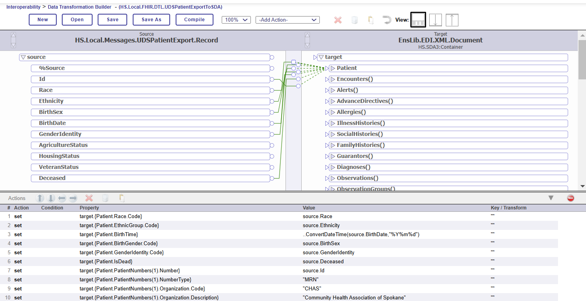

# Module 7 Exercise 1 - Mapping Custom File Data to SDA 

**Learning Objectives:** 
* Use the Record Mapper Utility for Delimited Data
* Create a Transformation DTL for XML Data
* Map a proprietary, delimited message to HS.SDA3.Container
* Validate a FHIR Resource using the FHIR Vaildator

**Task:** In this exercise, you will take a sample batch file in pipe-delimited format and transform it directly to SDA format which will then be transformed to a FHIR Patient Resource.

## Instructions:

### Task 1: Build the Record Map 
The sample file is pipe-delimited (|) and contains a batch of patient records. 

1. Create a new folder in the project at `iris-container/data/durable/` named `module7-exercise1-inbound`. 
2. Locate the sample file located in `iris-container/data/samples/UDS_patient_export_sample.txt`. Copy the file and paste it into the new folder created in Step 1. (This is necessary because the IRIS instance can only "see" files that are in the container environment. The `/data/durable` folder is mounted so it is visible from both the external and in-container environment) 
3.	**Open the Record Mapper Utility:** From the Home page of the Management Portal, go to **Interoperability -> Build -> CSV Record Wizard**. 

4. **Fill out the form with the following values:** 
First select the `UDS_patient_export_sample.txt` file by navigating `/irisdata/module7-exercise1-inbound`. You will have to change the filter to “All files”. 
* RecordMap name: UDSPatientExport
* Separator: |  (found on right side, SHIFT-backslash key)
* Record Terminator: CRLF
* Character Encoding: UTF-8
* Sample has header row: *checked*
* Click **Create RecordMap**
 
5. Click on the **Save As** button at the top. Rename the class name to package value: `HS.Local.FHIR.Messages` and Classname: `UDSPatientExport` so that the class saves in **HS.Local**. 

6. Click on the **Generate** button. This will generate two classes: 
* HS.Local.FHIR.Messages.UDSPatientExport
* HS.Local.FHIR.Messages.UDSPatientExport.Record

7. **Final Record Mapper Screen**
This screen can be used to edit the data type of the fields and add annotations for documentation as well deal with more complex formats with repeating structures, but for this exercise, you will deal with everything just as Strings and keep things flat.

### Task 2 - Map to SDA

Now that you have the source format built, you will need to determine where the fields need to be mapped in the SDA in order to map to the relevant location in the FHIR resource. 

1. Use the **FHIR Annotations** lookup from the Module 5 exercise to fill out the 
mapping table. Whenever you find a field that doesn’t have a direct mapping to the current SDA or FHIR R4/USCDI Resource, make a note about it. This will be addressed in the next exercise.

| **Source Field** | **SDA Location** |	**FHIR R4/USCDI Resource** |
|:------------------:|:--------------------:|:--------------------:|
| Id | | |			
| Race | | |			
| Ethnicity | | |			
| BirthSex | | |			
| BirthDate | | |			
| GenderIdentity | | |			
| AgricultureStatus | | |			
| HousingStatus | | |			
| VeteranStatus | | |			
| Deceased | | |			

2. Create a transformation DTL to map from **UDSPatientExport** record to the **HS.SDA3.Patient**.  
* Open the DTL Editor from the Management Portal: **Interoperability -> Build -> Data Transformations**. 
* Select New.  
* Fill out the Data Transformation Wizard:
    * Package: HS.Local.FHIR.DTL
    * Name: UDSPatientExportToSDA
    * Description: Map from Patient Record to SDA
    * Source Type: All Messages
    * Source Class: HS.Local.FHIR.Messages.UDSPatientExport.Record 
    * Target Type: XML
    * Target Class: EnsLib.EDI.XML.Document
    * Targe Document Type: HS.SDA3.Container
    * Click OK

4. Transforming Data 

Use the mapping table you worked on previously to map the inbound message to the SDA Patient section. (Note: It can be done with `set` statements)

### Task 3 - Create an end-to-end routing

1. **Open the VSCode:** Navigate to the module 6 durable folder in the iris container `iris-container/data/durable/module6-exercise1-code`. Then copy the file **HS.Local.FHIR.RecordMappertoSDAProcess** and paste it in the `iris-container/src/FHIRDEMO/HS/Local/FHIR` directory. Make sure you have saved the file and that it is compiled before moving on.

2. **Open the FHIRDEMO Production:** Navigate to the production by selecting **HOME->Interoperability**. You will see **FHIRDEMO** in the list of namespaces. Select **FHIRDEMO** and then in the next screen, click the **Go** button to view the production. 

3. **Add a Business Service:** Click on the plus `+` next to the **Services** header. 

Configure these **Business Service** settings in the wizard: 

| **Configuration Name**  | **Value** |
|:-----------------------:|:------------------:|
| Service Class | EnsLib.RecordMap.Service.FileService |
| Service Name | UDSPatientExportFileService |
| Display Category | Module7-Exercise1 |
| Enable Now | Selected |

The service should be added to the production now. 

4. **Add a Business Process:** Click on the `+` symbol next to the **Processes** header. 

Configure these **Business Process** settings in the wizard: 

| **Configuration Name**  | **Value** |
|:-----------------------:|:---------:|
| Business Process Class | HS.Local.FHIR.RecordMappertoSDAProcess |
| Business Process Name | FHIR.RecordMappertoSDA |
| Display Category | Module7-Exercise1 |
| Enable Now | Selected |

5. **Add the Standard FHIR Business Process:** Click on the `+` symbol next to the **Processes** header. (We will have two business processes).

Configure these **Business Process** settings in the wizard: 

| **Configuration Name**  | **Value** |
|:-----------------------:|:---------:|
| Business Process Class | HS.FHIR.DTL.Util.HC.SDA3.FHIR.Process |
| Business Process Name | HS.FHIR.DTL.Util.HC.SDA3.FHIR.Process2 |
| Display Category | Module7-Exercise1 |
| Enable Now | Selected |

6. **Add a Standard FHIR Server Operation:** Click on the `+` symbol next to the **Operations** header. 

Configure these **Business Operation** settings in the wizard: 

| **Configuration Name**  | **Value** |
|:-----------------------:|:--------------:|
| Operation Class | HS.FHIRServer.Interop.Operation |
| Operation Name | UDSFHIRServer.Operation |
| Display Category | Module7-Exercise1 |
| Enable Now | Selected |

7. **Build End-to-End**: Now you have four business components. In order to hook them together to run and end-to-end, we'll cover the **Properties** for each of the components. 

*7-1*. Start on the left by clicking on the icon/name for the **UDSPatientExportFileService** service: 

Then click on the **Settings** tab on the right panel to configure the service properties: 

| **Property Name**  | **Value** |
|:-----------------------:|:----------------------:|
| File Path | /irisdata/module7-exercise1-inbound/ |
| TargetConfigNames | FHIR.RecordMappertoSDA |
| RecordMap | HS.Local.FHIR.Messages.UDSPatientExport |

Make sure to click **Apply** to save your Settings. 

*7-2*. Click on the icon/name for the **FHIR.RecordMappertoSDA Process** Process. 

This is a custom process that is identifying what Record Field will be set as the `PatientResourceId`, which is required in the Patient Resource. Configure the following Settings.   

| **Property Name**  | **Value** |
|:-----------------------:|:---------------------------------:|
| PatientIdLocation | Id |
| DTLTransformationClass | HS.Local.FHIR.DTL.UDSPatientExportToSDA |
| TargetConfigNames | HS.FHIR.DTL.Util.HC.SDA3.FHIR.Process2 |

Make sure to click **Apply** to save your Settings. 

*7-3*. Click on the icon/name for the **HS.FHIR.DTL.Util.HC.SDA3.FHIR.Process2** Process. 

Configure the following Settings.   

| **Property Name**  | **Value** |
|:-----------------------:|:---------:|
| TargetConfigNames |  UDSFHIRServer.Operation | 
| TransmissionMode | transaction |
| FHIRMetadataSet | HL7v40 / FHIR R4 Core Specification |
| FHIREndpoint* | /csp/healthshare/fhirdemo/fhir/uds |
| LogTraceEvents | *checked* |
| TraceOperations | `*FULL*` |

* The **FHIREndpoint** path doesn't yet exist, but you will configure this in a few steps. 

Make sure to click **Apply** to save your Settings. 

*7-4*. Click on the icon/name for the **UDSFHIRServer.Operation** Operation. 

Configure the following Settings.   

| **Property Name**  | **Value** |
|:-----------------------:|:---------:|
| LogTraceEvents | *checked* |
| TraceOperations | `*FULL*` |

Make sure to click **Apply** to save your Settings. 

8. **Make Sure `HS.Util.Trace.Operations` is added** 

*This may already be done from previous exercise, if not...*

Click on the `+` on the Operations header to the right and add `HS.Util.Trace.Operations` as the Class name and Operation name. Select `Enable` and **Apply**. 

9. **Configure the FHIR Server**

With the **FHIRDEMO** namespace selected, click on **Home** and then select **HEALTH** either on the panel on the left or at the top of the System Management portal. 

Select the **FHIR Configuration** section: 

*9-1*. Log in with the same username and password for IRIS. User:`_system` Password: `SYS`

*9-2*. Select **Server Configuration** and then click the **Add Endpoint** button. 

Enter these configurations: 
Configure the following Settings.   

| **Property Name**  | **Value** |
|:-----------------------:|:---------:|
| CORE FHIR package | hl7.fhir.r4.core@4.0.1 |
| URL | /csp/healthshare/fhirdemo/fhir/uds |
| Additional packages | hl7.fhir.us.core@3.1.0 |
| Interactions Strategy Class | HS.FHIRServer.Storage.Json.Interactions.Strategy |
| Storage | *Keep all default values* |

Click **Add**. It will take a few minutes to build the endpoint. You can leave this screen and return to VSCode while the endpoint builds. 

10. **Create the data input directory in VS Code**

Typically, the file system in the Docker container is completely separate from the folders and files you have in the project folder. However, the container has been set up with a bind mount that connects the `iris-container/data/durable` folder in the FHIR-UDS-TRAINING project with the `/irisdata` folder in the IRIS instance. 

*10-1*. In VSCode, right click on the `iris-continer/data/durable` folder and select `Add Folder`. Name the folder `module7-exercise3-inbound` in order to match what you configured in the Business Service Settings in the IRIS production. 

11. **Check the Production:** Return to your System Management Portal. If you are looking at the "FHIR Server" screen, you can click on the profile icon for the `_system` user in the right corner. Once you click on the icon, select **Management Portal** to retrn **Home**.  

Go to **Home -> Interoperability -> Select FHIRDEMO -> Configuration -> Production**. 

Click on the **Messages** tab. You should see the available message traces. Click on the link under **Header** to trace the activity. 

If you see errors, read the error messages, double check settings, and try to fix things so you get a complete message trace (see below). If you ever need to re-run the message, you can re-send from the **Message Viewer** or drop the file again.

> Solution: The completed classes are located in the [Module 7 Solutions Folder](../solutions/exercise-1/FHIRDEMO.FoundationProduction.cls). This contains the production configuration, but does not contain the FHIR Server configuration. 
