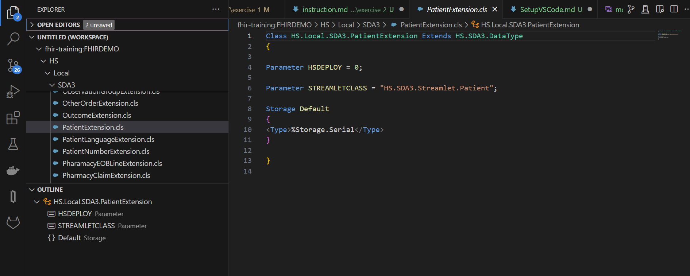
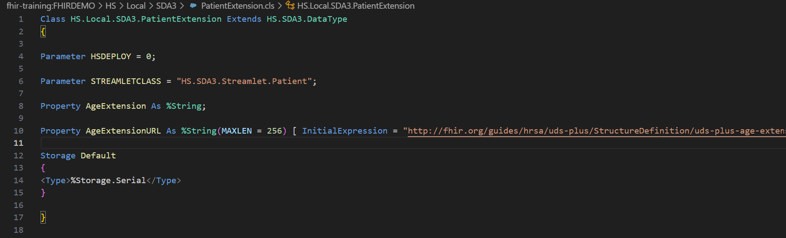
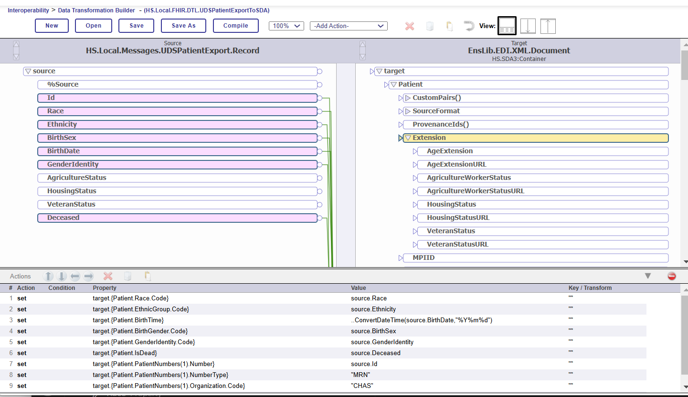

# Module 7 Exercise 2 - Creating SDA Extensions 

**Learning Objectives:** 
* Extending the `HS.SDA3.Patient` class 
* How to load and activate custom SDA extensions
* Updating existing Transformation DTLs with new extensions added

## Reference: 
This information can also be found in the InterSystems documentation: [Customizing the SDA](https://docs.intersystems.com/irisforhealthlatest/csp/docbook/DocBook.UI.Page.cls?KEY=HXSDA_ch_sda_custom)

**Task:** In this exercise, you will build on the previous exercise by extending the Patient class in the SDA to include custom properties

## Instructions:

**Before you begin:**
For this exercise, you will be accessing the IRIS classes using the **InterSystems Language Server - VSCode Extension**.

> If you do not have the Extension installed, refer to the instructions in **Module 5**. 

### Task 1: Modifying the Local Version of the SDA Class 

1. In your code editor, open the **HS.Local.SDA3.PatientExtension** class. This is located in the **HSCUSTOM** namespace but should be package mapped to all Foundation namespaces and available from **FHIRDEMO**. 

2. In order to add extensions, add properties to the class. Here's an example adding the `AgeExtension` and `AgeExtensionURL` properties: 

Follow the model and add these properties:

| **Property Name** | **DataType** | **MAXLEN** | **Initial Expression** |
|:------------------:|:--------------------:|:--------------------:|:--------------------:|
| AgeExtension | %String ||| 
| AgeExtensionURL | %String |MAXLEN = 256| "http://fhir.org/guides/hrsa/uds-plus/StructureDefinition/uds-plus-age-extension" |
| AgricultureWorkerStatus| %String ||
| AgricultureWorkerStatusURL | %String | MAXLEN = 256|  "http://fhir.org/guides/hrsa/uds-plus/StructureDefinition/ |udsplus-agriculture-worker-status" |
| HousingStatus | %String ||
| HousingStatusURL | %String | MAXLEN = 256| "http://fhir.org/guides/hrsa/uds-plus/StructureDefinition/uds-plus-housing-status-extension" |
| VeteranStatus | %String ||
| VeteranStatusURL | %String | MAXLEN = 256| "http://fhir.org/guides/hrsa/uds-plus/StructureDefinition/uds-plus-veteran-status-extension" |

3. Recompile the `HS.SDA3` classes. 
* In VSCode, navigate to the `HS.SDA3` package in **FHIRDEMO**. These packages are mapped from **HSLIB** and should be available from any Foundation namespace. 
* Right click and select **Compile**. This will compile the new version of the `HS.Local.SDA3.PatientExtension` into the package. 

4. Import the HS.SDA3 Schema into the namespace. 

* In Management Portal: Navigate to **Health > HSDEMO > Schema Documentation** 

* Click the **Import SDA3 Schema** button.

5. If you re-open the DTL you created in the previous exercise, the **Patient** class inside the SDA Container should have the new extensions you added. You may need to re-open the DTL if you had it open all this time. If you don't see the extensions still, repeat the compilation and import steps. 

## Task 2 - Map Source Data into the New Extensions 

1. Modify your existing DTL by mapping the source fields into the extensions. 
2. You do not need to map anything into the "URL" extensions. Remember the `InitialExpression` values you set? These properties are defaulted to those values if left empty.

## Task 3 - Test the new Extension mapping

1. Run a test by resending a previous message or by copying the `UDS_patient_export_sample.txt` from the **samples** directory into the **iris-container/data/durable/module7-exercise1-inbound** folder. 

2. Confirm in the Message Viewer that the SDA extension mapping is carrying through in the SDA that is sent to the FHIR Process. 

3. Those new extensions are not yet mapped to the FHIR Patient resource. The next step would be to add those extension mappings to the customized **HS.Local.FHIR.DTL.SDA3.vR4.Patient.Patient** that you created in **Module 6 - Exercise 2**.

> Solution: The completed extension class is located in the [Module 7 Solutions Folder](../solutions/exercise-1/FHIRDEMO.FoundationProduction.cls). The extension is included, but not the final DTL Transformation. 
